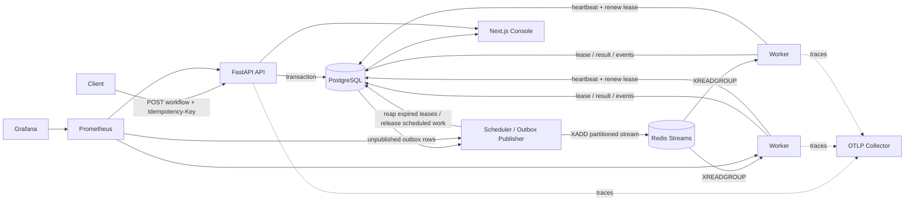

# durable-workflow-engine

A deliberately small, technically serious durable workflow orchestration engine built to demonstrate distributed-systems engineering: leases, recovery, at-least-once delivery, idempotent effects, an outbox, backpressure, observability, property tests, and chaos scenarios.

> This project is educational infrastructure. It is **not** intended to replace Temporal, Celery, Kafka, or a managed workflow platform.

## What it demonstrates

- Durable workflow definitions with DAG validation and dependency release
- PostgreSQL as the authoritative workflow/task state machine
- Redis Streams as partitioned, at-least-once task transport
- Worker registration, heartbeats, leases, lease expiry, graceful shutdown
- Retries with exponential backoff and full jitter, scheduling, task timeouts
- Workflow cancellation, dead-lettering, poison-message handling
- Idempotency keys, duplicate submission handling, task/result persistence
- Transactional outbox publication and state reconstruction from durable rows/events
- Per-queue global concurrency and token-bucket rate limits backed by Redis
- OpenTelemetry traces across API -> outbox/queue -> worker -> database
- Prometheus metrics and a Grafana dashboard
- Next.js monitoring console with workflow graph, task states, retries, workers, DLQ, timeline
- pytest, Hypothesis, integration tests, Docker chaos scenarios, and k6 load tests

## Architecture



### Why PostgreSQL is authoritative

Redis may restart, a stream entry may be duplicated, or a consumer may die after performing work but before acknowledging a message. The queue therefore carries **delivery hints**, not truth. A worker must atomically acquire a PostgreSQL lease before executing a task. Duplicate queue messages that cannot acquire the durable task transition are harmless.

The scheduler publishes ready work through a transactional outbox. If it crashes after publishing but before marking the outbox row published, the message is published again. That is intentional: publication is at-least-once and consumers are designed to tolerate duplicates.

## Quick start

```bash
cp .env.example .env
docker compose up --build
```

Then open:

- API docs: http://localhost:8000/docs
- Monitoring console: http://localhost:3000
- Prometheus: http://localhost:9090
- Grafana: http://localhost:3001 (admin/admin)

Create a workflow:

```bash
curl -sS http://localhost:8000/v1/workflows \
  -H 'Content-Type: application/json' \
  -H 'Idempotency-Key: invoice-2026-0001' \
  -d '{
    "name":"invoice-pipeline",
    "tasks":[
      {"key":"generate_invoice","kind":"noop","queue":"billing","payload":{"invoice_id":"INV-1"}},
      {"key":"charge_customer","kind":"flaky","queue":"billing","depends_on":["generate_invoice"],"payload":{"fail_until_attempt":1}},
      {"key":"send_receipt","kind":"noop","queue":"email","depends_on":["charge_customer"]},
      {"key":"update_analytics","kind":"noop","queue":"analytics","depends_on":["send_receipt"]}
    ]
  }'
```

## Delivery semantics

This engine intentionally exposes the tradeoffs instead of claiming “exactly once” delivery.

- **At-most-once delivery** avoids duplicates by never retrying after uncertainty, but can lose work.
- **At-least-once delivery** retries uncertain work, which preserves progress but permits duplicate execution.
- **Exactly-once delivery** across a database, queue, process, and arbitrary external service cannot generally be guaranteed without a single shared transaction boundary.
- **Exactly-once effects** are achievable in many practical cases when the side-effect target accepts an idempotency key, or when the effect is committed inside the same database transaction.

See [docs/DELIVERY_SEMANTICS.md](docs/DELIVERY_SEMANTICS.md) and `examples/idempotency_demo.py`.

## Failure Scenarios

| Failure | Expected behavior |
|---|---|
| Worker dies after lease acquisition | Lease expires; scheduler schedules retry; another worker acquires it |
| Worker finishes side effect but dies before ACK | Stream entry can be redelivered; durable task state/idempotency prevents duplicate effect where supported |
| Queue message duplicated | Only a task in an executable durable state can acquire a lease |
| Heartbeat delayed beyond lease TTL | Task can be retried; handler must be idempotent because overlapping execution is possible |
| Redis restarts | PostgreSQL/outbox retains ready work; publisher and consumers reconnect and republish |
| API restarts | Submitted workflows remain in PostgreSQL; workers/scheduler continue |
| External operation fails transiently | Retry policy schedules exponential backoff + jitter |
| Client retries workflow submission | Workflow idempotency key returns the existing workflow |
| Poison/malformed stream entry | Entry is acknowledged and copied to the DLQ stream; poison metric increments |
| Max attempts exhausted | Task becomes `dead_letter`; workflow becomes failed |
| Cancellation during execution | Worker observes durable cancellation before committing success; external effects still require idempotency |

## Development

```bash
python -m venv .venv
source .venv/bin/activate
pip install -e '.[dev]'
ruff check .
mypy backend/app
pytest -m 'not integration and not chaos'
```

Integration services:

```bash
docker compose up -d postgres redis
pytest -m integration
```

Chaos suite:

```bash
./scripts/chaos-compose.sh
```

## Load testing

Start the stack, then run:

```bash
./scripts/run-benchmark.sh
```

The script writes a timestamped k6 JSON summary under `load/results/`. This repository does **not** publish made-up throughput numbers. Any benchmark table added later must link to a checked-in result artifact produced by an actual run and include the hardware/software context.

## Repository layout

```text
backend/app/              engine, API, worker, scheduler
backend/tests/            unit, property, integration, recovery tests
web/                      Next.js monitoring console
observability/            Prometheus + Grafana configuration
load/                     k6 scenario
scripts/                  benchmark and Docker chaos harness
docs/                     architecture, semantics, failure modes, ADRs
```

## License

MIT
