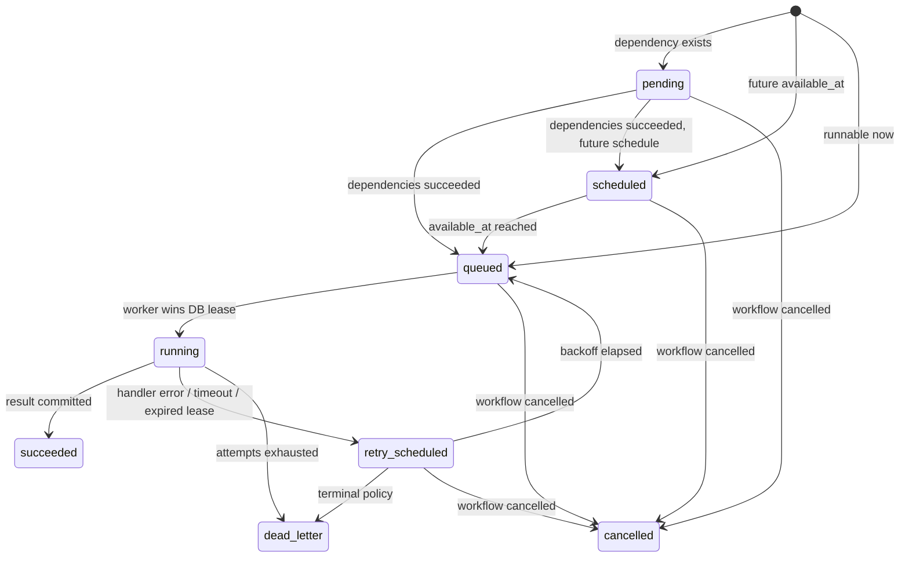

# Architecture

## Design objective

`durable-workflow-engine` is intentionally small enough to understand end-to-end while retaining the failure boundaries that make workflow systems difficult: durable state, duplicate delivery, leases, retries, cancellation, external side effects, queue loss/restart, and process crashes.

The engine separates **authority** from **transport**:

- PostgreSQL is the source of truth for workflow/task state, attempts, leases, results, workers, timeline events, and the outbox.
- Redis Streams is a partitioned at-least-once notification/delivery mechanism. A Redis entry never grants permission to execute by itself.
- Workers must perform a conditional PostgreSQL state transition from `queued` to `running` and acquire a lease before executing.

## Components

### API

FastAPI validates workflow definitions, rejects invalid DAGs, handles submission idempotency, persists workflows/tasks, exposes cancellation and monitoring endpoints, and never directly publishes ready work to Redis. Ready-task publication is represented by an outbox row in the same database transaction as the task state change.

### Scheduler / outbox publisher

One process performs several idempotent maintenance loops:

1. publish unpublished outbox rows to Redis Streams;
2. release scheduled/retry-delayed tasks whose `available_at` is due;
3. reap expired worker leases and schedule retries/dead-letter tasks;
4. republish old `queued` tasks to recover from queue loss or a consumer dying before lease acquisition;
5. mark workers stale when heartbeats stop;
6. sample queue/dead-letter metrics.

Multiple scheduler replicas are safe for outbox/reaper work because rows are selected using `FOR UPDATE SKIP LOCKED`. The current demo runs one scheduler to keep local topology simple.

### Redis Streams transport

Each logical queue has `QUEUE_PARTITIONS` streams:

```text
dwe:q:<queue>:0
dwe:q:<queue>:1
...
```

Task IDs are assigned to partitions using BLAKE2b so a task consistently maps to a stream. Workers consume all partitions for queues they serve using a Redis consumer group.

Partitioning is a throughput primitive, not an ordering guarantee across a workflow. Dependency ordering comes from PostgreSQL state transitions.

### Workers

A worker:

1. registers durable worker metadata;
2. consumes a stream message;
3. waits for the queue token-bucket rate limiter;
4. acquires a queue-wide Redis concurrency slot with TTL;
5. conditionally acquires the PostgreSQL task lease;
6. executes the handler under an asyncio timeout while renewing its lease;
7. transactionally persists success/failure and dependency release;
8. ACKs the Redis message only after durable state has been written.

If the process dies at any point, lease expiry and/or outbox republishing reconstructs runnable work.

## Durable task state machine



A running task can race with cancellation or lease expiry. Therefore committing success is conditional on still owning the durable lease and the workflow not being cancelled.

## Dependency release

Dependencies are stored as task keys in each task row. On success, the worker locks all workflow tasks, checks candidate downstream tasks, and releases only those for which every dependency is durably `succeeded`.

This is intentionally simple and correct for the project's bounded workflow size (maximum 1,000 tasks). A production engine at much larger scale would normalize dependency edges and release children using indexed edge tables to avoid locking/scanning the workflow task set.

## Retry model

Attempts increment when a lease is acquired, not when a queue message is seen. Duplicate queue messages therefore do not consume retry budget.

Failures use exponential backoff with full jitter:

```text
upper_bound = min(max_delay, base_delay * 2^(attempt - 1))
delay ~ Uniform(0, upper_bound)
```

The chosen `available_at` is stored in PostgreSQL. A scheduler restart does not reset the retry delay.

## Leases and heartbeat

Task leases are database timestamps owned by a worker ID. Workers periodically renew them. A scheduler can reclaim `running` tasks whose lease expired.

A delayed heartbeat creates the possibility of **overlapping execution**: worker A may still be performing a side effect when its lease expires and worker B retries the task. Leases provide liveness and fencing of durable state transitions; they do not make arbitrary external effects exactly once. Handlers must use downstream idempotency keys/fencing where side effects matter.

## Concurrency and rate limits

There are two queue guards:

- local `asyncio.Semaphore` caps tasks inside a worker;
- a Redis sorted-set semaphore caps queue-wide active tasks across workers, with TTL so crashed workers do not leak permits;
- a Redis Lua token bucket enforces a queue-wide request rate.

These controls are availability mechanisms. PostgreSQL task leases remain the correctness boundary.

## State reconstruction

No workflow state is reconstructed from Redis. The monitoring API reads workflow/task rows and the append-only task event timeline. After an API, worker, scheduler, or Redis restart, the current state can be derived entirely from PostgreSQL.

## Trace propagation

The API/database path is auto-instrumented. When the scheduler publishes `task.ready`, W3C trace context is injected into Redis fields. Workers extract that context and create a `workflow.task.execute` span, allowing a trace to cross the asynchronous queue boundary.

## Known scope boundaries

This project deliberately does not implement:

- arbitrary user code sandboxing;
- cross-region consensus or multi-primary PostgreSQL;
- workflow version migrations / deterministic replay like Temporal;
- dynamic DAG mutation after submission;
- a globally ordered event log;
- exactly-once arbitrary external side effects;
- multi-tenant auth/RBAC.

Those omissions keep the project focused on durability and delivery semantics rather than pretending to be a production replacement for mature workflow platforms.
